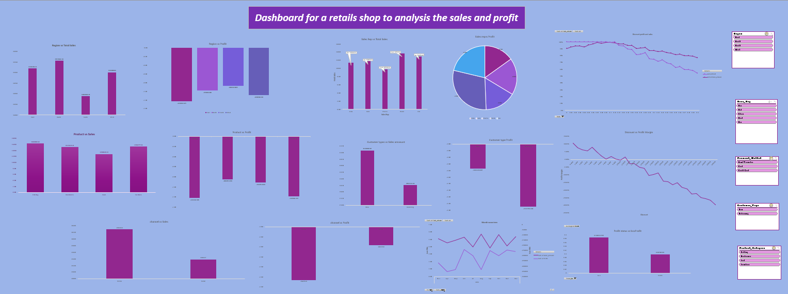

# 📊 Excel Sales Performance Dashboard

An interactive **Sales & Profit Performance Dashboard** built using Microsoft Excel to analyze sales performance, profitability, customer behavior, product categories, sales representatives, regions, and sales channels.

This project demonstrates practical skills in **Excel data analysis, PivotTables, PivotCharts, calculated fields, slicers, KPI analysis, and business-oriented data visualization.**

---

## 📌 Project Overview

The objective of this project is to analyze retail sales data and transform raw transactional data into an interactive dashboard that can help identify:

- Overall sales and profit performance
- Regional sales performance
- Sales representative performance
- Product category performance
- Customer type performance
- Sales channel performance
- Monthly sales and profit trends
- Discount vs. profit margin relationship
- Profitable vs. loss-making transactions
- Payment method performance

The dashboard is designed to provide a quick and visual overview of business performance and support data-driven decision-making.

---

## 🛠️ Tools & Technologies

- **Microsoft Excel**
- PivotTables
- PivotCharts
- Slicers
- Excel Formulas
- Calculated Fields
- Data Aggregation
- Data Cleaning & Preparation
- Data Analysis
- Data Visualization
- KPI Analysis

---

## 📂 Dataset Overview

The dataset contains **1,000 sales transactions** with information related to:

- Product ID
- Sale Date
- Sales Representative
- Region
- Product Category
- Customer Type
- Sales Channel
- Payment Method
- Sales Amount
- Profit
- Quantity Sold
- Discount

The data was analyzed using Excel PivotTables and visualized through an interactive dashboard.

---

## 📊 Key KPIs

| KPI | Value |
|---|---:|
| Total Sales | **59.69M** |
| Total Profit | **-4.16M** |
| Overall Profit Margin | **-6.96%** |
| Total Quantity Sold | **25,355** |
| Total Transactions | **1,000** |

> **Note:** The negative total profit indicates that the business experienced an overall loss during the analyzed period.

---

## 📈 Dashboard Preview



---

## 📊 Dashboard Features

### 1. Regional Performance

Analyzes sales and profit performance across:

- East
- North
- South
- West

This helps identify which regions generate higher sales and where profitability needs improvement.

---

### 2. Sales Representative Performance

Compares sales representatives based on total sales and profit.

Sales representatives analyzed:

- Alice
- Bob
- Charlie
- David
- Eve

This allows management to compare individual sales performance and identify representatives with high sales but weak profitability.

---

### 3. Product Category Analysis

Analyzes performance across major product categories:

- Clothing
- Electronics
- Food
- Furniture

The analysis compares total sales and profit to identify stronger and weaker product categories.

---

### 4. Customer Type Analysis

Compares sales and profit performance between different customer types.

This helps understand which customer segments contribute more to revenue and which segments require further attention.

---

### 5. Sales Channel Analysis

Analyzes performance across different sales channels, including:

- Online
- Retail

This provides insight into how different sales channels contribute to overall business performance.

---

### 6. Monthly Sales & Profit Trend

The dashboard tracks monthly sales and profit performance across the available period.

The trend analysis helps identify:

- Monthly sales fluctuations
- Profitability changes
- Strong and weak performing months
- Changes in business performance over time

---

### 7. Discount vs. Profit Margin Analysis

Analyzes the relationship between discount levels and profitability.

The analysis indicates that as discount levels increase, profit margin generally declines, highlighting the potential impact of heavy discounting on profitability.

---

### 8. Profitability Analysis

Transactions were categorized based on whether they generated positive or negative profit.

| Profit Status | Transactions |
|---|---:|
| Loss per Unit | **604** |
| Positive per Unit | **396** |
| Total | **1,000** |

This indicates that a significant portion of transactions were not profitable.

---

### 9. Payment Method Analysis

Sales and profit were analyzed across:

- Bank Transfer
- Cash
- Credit Card

This helps compare business performance across different payment methods.

---

## 🔎 Key Business Insights

### 💰 Overall Profitability

The business generated approximately **59.69M in total sales**, but the overall profit was approximately **-4.16M**, resulting in an overall profit margin of around **-6.96%**.

This suggests that increasing sales alone is not sufficient; improving cost control and profitability should be a major business priority.

---

### 📉 High Number of Loss-Making Transactions

Out of 1,000 transactions:

- **604 transactions** were loss-making
- **396 transactions** generated positive profit

This shows that profitability is a major area requiring attention.

---

### 🏷️ Discount Impact

The discount analysis shows a clear downward movement in profit margin as discount levels increase.

This suggests that excessive discounting may be contributing to lower profitability.

---

### 📅 Monthly Performance

Monthly sales performance fluctuates significantly throughout the year.

Some months generate considerably higher sales than others, while profit remains negative across most of the 2023 period.

This indicates the need to investigate the underlying causes of monthly profitability differences.

---

### 👥 Sales Representative Performance

Sales performance varies among sales representatives.

An important business observation is that **higher sales do not necessarily mean higher profitability**. Therefore, sales representatives should ideally be evaluated using both revenue and profit-related KPIs.

---

## 🎯 Business Recommendations

Based on the analysis, the following actions could be considered:

1. **Review pricing and cost structure** to address the overall negative profit.
2. **Reduce excessive discounting** where discounts are significantly affecting margins.
3. Monitor **profit margin alongside sales revenue** when evaluating sales performance.
4. Investigate the reasons behind the high number of loss-making transactions.
5. Analyze underperforming products and regions to identify cost or pricing problems.
6. Evaluate sales representatives using both **sales and profitability**, rather than sales alone.
7. Monitor monthly trends to identify recurring periods of weak profitability.

---

## 🧠 Skills Demonstrated

Through this project, I practiced and demonstrated:

- Data analysis using Microsoft Excel
- Data organization and preparation
- PivotTable creation
- PivotChart creation
- Slicer implementation
- KPI calculation
- Profit margin analysis
- Sales trend analysis
- Business performance analysis
- Data visualization
- Dashboard design
- Business insight generation
- Translating raw data into actionable insights

---

## 📁 Project Structure

```text
Excel-Sales-Dashboard/
│
├── README.md
├── Excel_Sales_Performance_Dashboard.xlsx
└── Dashboard_Image.png
